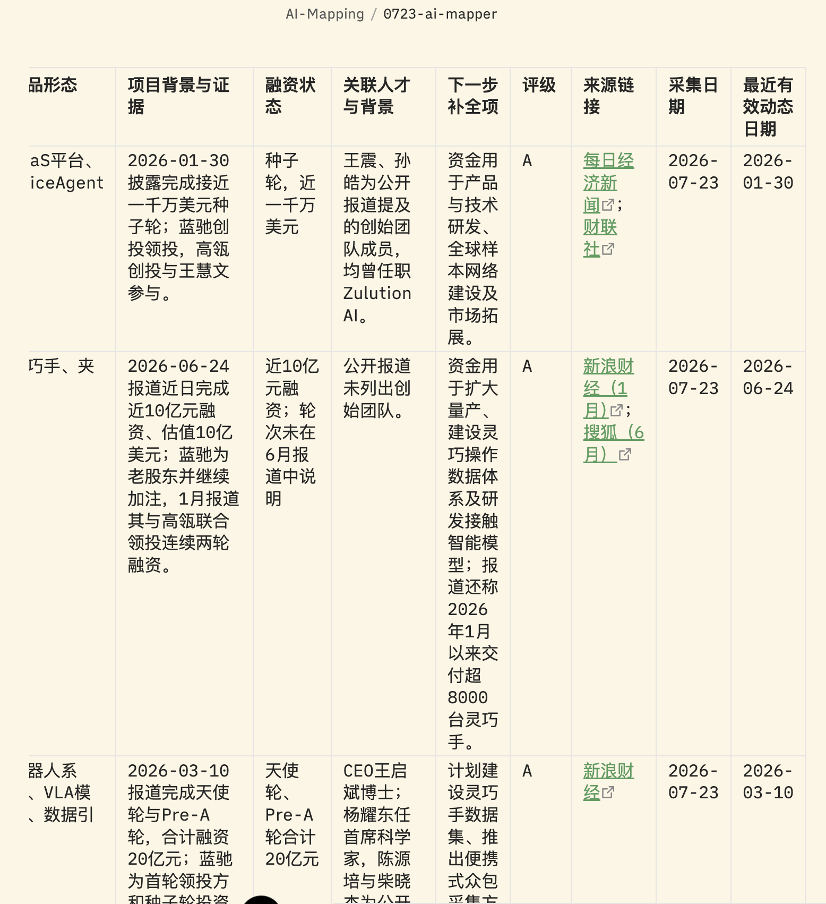

# AI Mapper

**面向中国 / 中国相关早期 AI 软件项目与人才线索的证据驱动 Mapping Skill**

[](SKILL.md)
[](references/exa-query-plan.md)
[](scripts/validate_run.py)

AI Mapper 将 `/ai-mapper` 请求转化为**可追溯、可复核、可落盘的 Obsidian 研究报告**。它不是一个只把搜索摘要贴进聊天窗口的检索器，而是一套带有 Exa 召回审计、公开网页补证、结构化中间产物和最终验证闸门的研究工作流。

> [!IMPORTANT]
> `SKILL.md` 是本仓库的可执行契约。README 说明其工作方式；实际运行规则、字段定义和最低门槛以 `SKILL.md` 及 `references/` 中的规范为准。

## 目录

- [AI Mapper 解决什么问题](#ai-mapper-解决什么问题)
- [适用范围](#适用范围)
- [核心工作流](#核心工作流)
- [Exa query-plan-first](#exa-query-plan-first)
- [四条检索 lane](#四条检索-lane)
- [证据与公开网页补证](#证据与公开网页补证)
- [验证闸门与运行状态](#验证闸门与运行状态)
- [输出物与路径](#输出物与路径)
- [安装与快速开始](#安装与快速开始)
- [仓库结构](#仓库结构)
- [运行截图](#运行截图)
- [限制与质量规则](#限制与质量规则)
- [测试](#测试)

## AI Mapper 解决什么问题

AI Mapper 面向以下研究任务：

- 发现中国或与中国相关的早期 AI 软件项目、创业团队、独立开发者、开源构建者和合格的人才线索；
- 对 AI Agent、MCP、coding agent、AI 办公 / 生产力、agent memory、个人 AI、开发者工具、工作流集成、agent / coding security，以及与 routing、cost、runtime 相关的 AI infra 做通用扫描；
- 将“项目是什么、为什么值得看、已有证据、缺什么、下一步补全项”整理为 source-backed 的项目 / 人才记录；
- 把原始召回、候选 triage、证据、验证、评级和最终报告分别保存，便于后续复盘与修复。

普通运行固定使用 `TOPIC=通用扫描`，不会因为用户提到某个方向就把全局扫描悄悄缩窄。只有明确要求“深度扫”“全量市场地图”“尽可能不要漏”等高召回表达时，才切换到 `deep map`。

## 适用范围

### 优先覆盖

| 范畴 | 关注点 |
| --- | --- |
| AI 软件产品 | Agent、MCP、coding agent、办公 / 生产力、个人 AI、工作流与开发者工具 |
| 早期项目 | 新近发布、开源、产品化、客户 / 部署、早期融资或公司事件 |
| 人才线索 | 有近期、可验证行动，并能由公开来源确认其项目关系与背景的人 |
| 学术产品化 | 论文 / 系统 / 模型进入 Repo、Demo、产品或创业项目 |

### 默认作为背景

广义机器人 / 具身智能、泛多模态 / 视频 / 3D、纯海外项目、成熟公司、B 轮及以后、大额成熟融资、平台级项目，以及没有明确项目化路径的泛媒体 / Newsletter / Podcast。除非用户明确要求，否则不将这些范围当作主扫描目标。

## 核心工作流

```text
Setup & preflight
      ↓
固定 TOPIC=通用扫描 + 研究轴
      ↓
编译 exa-query-plan.jsonl
      ↓
按计划执行 Exa 四 lane 召回
      ↓
强制持久化每条 Exa 返回 URL
      ↓
候选 triage / 去重 / 打开必审页面
      ↓
Elsewhere（可用时）补充发现与融资 pass
      ↓
公开网页补证 Team / Funding / Product / Date
      ↓
validated.md → rated.md → JSONL 对齐
      ↓
guard-final + validate_run.py
      ↓
写入最终报告、raw、latest pointer、run report
```

研究过程中的原始数据不应只留在上下文或聊天记录里。每次运行都应在 workspace 中保留可验证的中间产物；最终回复只需返回状态、路径、计数和限制，而不是把大表粘贴进聊天。

## Exa query-plan-first

这是 AI Mapper 的硬规则：**一旦生成 `exa-query-plan.jsonl`，之后的 Exa 请求只能来自该文件的计划行；禁止 freehand Exa recall。**

### 为什么先做计划

研究轴负责语义判断，编译器负责按 lane、source family、query variant 和日期窗口展开查询：

```text
research axis × source family × query variant × date window
```

每次普通扫描必须包含四个 base axis，最多再增加两个 enhancement axis。四个 base role 与 lane 一一对应：

- `developer-product`
- `product-market`
- `funding-company`
- `academic-productization`

增强轴只能扩大召回，不能替换基础覆盖；编译器还会为增强轴保留有界的 lane 查询份额。

### 生成与执行

```bash
BASE="/Users/lixiaoran/ObsidianVault/AI-Mapping"
DATE="$(date +%m%d)"
WORKSPACE="$BASE/runs/ai-mapper-$(date +%Y%m%d-%H%M%S)"
RUN_MODE="adaptive standard scan"
mkdir -p "$WORKSPACE/results" "$BASE/raw" "$BASE"

# 先运行 preflight，并确认 Exa / Elsewhere / context-mode 状态
python3 scripts/preflight.py --run-mode "$RUN_MODE" --exa-status available

# 由 research-axes.json 编译计划；此后只执行计划中的 query_id
python3 scripts/build_exa_query_plan.py compile \
  --workspace "$WORKSPACE" \
  --run-mode "$RUN_MODE"

# 每个计划查询的 Exa response 必须通过 recorder 持久化
python3 scripts/forced_pipeline.py record-exa-response \
  --workspace "$WORKSPACE" \
  --query-plan-file "$WORKSPACE/exa-query-plan.jsonl" \
  --query-id "$QUERY_ID" \
  --response-file "$RESPONSE_FILE" \
  --collection-date "$(date +%F)" \
  --run-mode "$RUN_MODE"
```

`record-exa-response` 会把返回 URL 写入 `exa-candidates.jsonl`，并为每个已执行查询（包括零结果查询）写入 `exa-query-execution.jsonl`。Exa 的 rank、snippet、summary、返回日期和执行状态只是路由 / 审计信息，不是最终证据。

## 四条检索 lane

AI Mapper 固定使用四条 raw-search lane，而不是为四条 lane 各自启动一个搜索 agent。

| Lane | Base role | 要回答的问题 | 典型产出 |
| --- | --- | --- | --- |
| `A-dev` | `developer-product` | 开发者或产品团队最近交付了什么？ | Repo、release、产品、模型、Demo、维护者 |
| `B-content` | `product-market` | 有什么产品、客户、部署或市场验证？ | 用户 / 客户证据、部署、创始人关系、商业化线索 |
| `C-funding` | `funding-company` | 发生了什么早期融资或公司事件？ | 天使 / 种子 / Pre-A、投资方、公司事件、真实日期 |
| `D-academic` | `academic-productization` | 论文 / 系统 / 模型如何进入产品化？ | Paper、Repo、Benchmark、Demo、产品或创业信号 |

学术证据应进入已有项目行；除非独立满足人才条件，否则不创建单独的 academic talent table。

默认 `adaptive standard scan` 的四 lane 目标如下。它们是运行模式中的预算范围，不是本 README 声称已完成的结果。

| Lane | 查询 | 候选 URL | 打开页面 | raw leads |
| --- | ---: | ---: | ---: | ---: |
| `A-dev` | 10–14 | 40–70 | 12–22 | 8–15 |
| `B-content` | 8–12 | 35–60 | 10–18 | 6–12 |
| `C-funding` | 14–22 | 70–140 | 24–42 | 12–25 |
| `D-academic` | 8–12 | 35–60 | 10–18 | 6–12 |

只有明确要求高召回时才使用 `deep map`，其 lane 预算与最低 gate 见 [`references/run-modes.md`](references/run-modes.md)。

## 证据与公开网页补证

### Evidence boundary

最终项目 / 人才记录不能只靠 Exa 结果成立。对可能进入 A / B 的项目和所有命名人物，必须进行公开网页补证，至少尝试核验：

- **Team**：公司或产品 About / Team、创始人访谈、GitHub 组织 / maintainer、论文作者 / lab、公开个人站点、公开 X / GitHub profile；
- **Funding**：公司公告、投资方 / VC portfolio 或 newsroom，以及直接可打开的投融资报道；
- **Product proof**：产品站、docs、Demo、GitHub release、Hugging Face / ModelScope、论文项目页、客户 / 部署页；
- **Date proof**：原始文章 / 页面、融资公告、release / tag、模型上传、论文 v1 或客户 / 部署日期。

证据等级为 `S`、`A`、`B`、`C`、`无效`。A / B 行至少需要一个可打开、可追溯且非 `无效` 的证据对象；还需要真实事件日期，或清楚记录为什么日期不适用。`true_event_date` 与来源页面日期分开记录，不能以 Exa crawl date、rank 或 snippet 代替。

### Elsewhere 的边界

Elsewhere API 是 complete 运行的必需来源层，并用于：

1. Exa query drafting 前的 keyword intelligence；
2. `validated.md` 前的项目 / 人物发现；
3. 归因后的 source / context checks；
4. 可用时执行显式的 financing / startup candidate pass。

Elsewhere 不替代公开网页对 Team、Person、Background、Contact、Funding、Product proof 或 Date verification 的补证。没有 key、额度耗尽或限流时，应继续 Exa + open public sources，并准确标记 `degraded / Exa-only`，使用标准输出路径，不创建 `*-exa-only` 的替代文件名。

## 验证闸门与运行状态

AI Mapper 遵循 fail-closed 原则：在强制 gate 没有通过前，不写最终 artifact、不更新 latest pointer，也不把运行称为 `complete`。

```bash
# Elsewhere 可用时
python3 scripts/forced_pipeline.py guard-final \
  --workspace "$WORKSPACE" \
  --run-mode "$RUN_MODE" \
  --elsewhere-status available

python3 scripts/validate_run.py --workspace "$WORKSPACE"
```

`guard-final` 关注召回、Elsewhere 和打开页面 gate；`validate_run.py` 关注 schema、引用关系、计划执行完整性与证据边界。常规模式的总量最低门槛包括：36 条 Exa query / source paths、160 个候选 URL、50 个打开 / fetched 原始页面、30 条 raw P0/P1 leads、10 个 source families，以及 6 个 C-funding source families。C-funding 另有 12 条 query/source paths、70 个候选 URL、18 个打开页面和 10 条 raw financing/startup leads 的最低 gate；Elsewhere financing/startup candidate facts 最低为 5（complete 运行）。

运行状态只有三种：

| 状态 | 条件 | 输出规则 |
| --- | --- | --- |
| `complete` | Elsewhere、Exa、公开证据和所选模式最低 gate 均满足 | 写入全部标准路径 |
| `degraded / Exa-only` | Elsewhere 不可用，但 Exa / 公开网页 gate 满足 | 写入同样的标准路径，并显式写明 Elsewhere 缺失与公开搜索 gaps |
| `blocked` | Exa 不可用、无法持久化、workspace 不可写，或完成必要尝试后仍无法用公开来源验证 | 写 run report 和 blocker；不产出 decision-ready A/B 表 |

under-minimum 本身不能在 Exa 和 workspace 都可用时被拿来伪装成 `blocked`；应继续召回、打开和验证工作。

## 输出物与路径

脚本运行 workspace 的标准结构为：

```text
/Users/lixiaoran/ObsidianVault/AI-Mapping/
├── runs/ai-mapper-YYYYMMDD-HHMMSS/
│   ├── topic.md
│   ├── topics.md
│   ├── research-axes.json
│   ├── exa-query-plan.jsonl
│   ├── exa-query-execution.jsonl
│   ├── exa-candidates.jsonl
│   ├── candidates.jsonl
│   ├── evidence.jsonl
│   ├── results/
│   │   ├── A-dev.md
│   │   ├── B-content.md
│   │   ├── C-funding.md
│   │   └── D-academic.md
│   ├── validated.md
│   ├── rated.md
│   ├── AI项目与人才Mapping.md
│   └── run-report.md
├── MMDD-ai-mapper.md
├── raw/MMDD-ai-mapper-raw.md
└── 最新AI项目与人才Mapping.md
```

最终报告必须从 `运行状态` block 开始，包含完整的 A / B / C / 暂不跟进表、Elsewhere 摘要、lane 覆盖、真实日期审计、来源质量复盘、原始文件链接和限制。`run-report.md` 还要记录每个 gate 的 `Gate | Required | Actual | Pass? | Notes` 表，以及 lane 实际量、预算、marginal-yield check、来源覆盖、公开来源限制和最终计数。

## 安装与快速开始

AI Mapper 是一个 skill package，不是带 `pip install` 或 npm 发布包的独立应用。运行环境需要：

- 能执行 Python 3 脚本的环境；
- 可用的 Exa 工具面；
- 可写的 Obsidian 输出目录（默认见 `SKILL.md` 的 `Paths`）；
- complete 运行所需的 Elsewhere key（`ELSEWHERE_KEY`，或 `~/.config/elsewhere/key`）；
- 可选的 context-mode，用于上下文卫生，不作为证据。

```bash
git clone https://github.com/sephirxxxz/ai-mapper-exa-prompt-modified.git
cd ai-mapper-exa-prompt-modified

# 先看契约与运行规范
less SKILL.md
python3 scripts/preflight.py --help

# 验证 skill package（不需要伪造研究 workspace）
python3 scripts/validate_run.py

# 在实际运行前准备 workspace，并按“Exa query-plan-first”执行
```

推荐先运行 preflight，再按 [`SKILL.md`](SKILL.md) 的 Step 1–9 完成一次 mapping。不要跳过 `record-exa-response`、公开网页补证或最终两个验证命令。

## 仓库结构

| 路径 | 用途 |
| --- | --- |
| [`SKILL.md`](SKILL.md) | 可执行契约、触发条件、工作流、路径、反模式与交付规则 |
| [`scripts/preflight.py`](scripts/preflight.py) | Elsewhere key / API、Exa 和 context-mode 的 preflight 分类 |
| [`scripts/build_exa_query_plan.py`](scripts/build_exa_query_plan.py) | 把四个 base axis（及最多两个 enhancement）编译成 Exa 查询计划 |
| [`scripts/forced_pipeline.py`](scripts/forced_pipeline.py) | 强制记录 Exa response，并在 final 前 fail closed |
| [`scripts/validate_run.py`](scripts/validate_run.py) | 验证 skill package 或运行 workspace |
| `references/` | run modes、source policy、schemas、rating、evidence 和 blocker 规范 |
| `tests/` | query plan、forced pipeline、run validation 测试 |
| `agents/openai.yaml` | AI Mapper 的显示名称、简介与默认提示 |
| `assets/screenshots/` | workflow 与输出示例截图 |

## 运行截图

以下截图来自仓库现有的三张图片，用于展示工作流概览、研究流程和输出形态；它们不是 benchmark，也不代表任何未在当前运行中验证的数量或效果。

### 工作流概览


### 研究工作流



### 输出示例


## 限制与质量规则

- **当前网页优先**：项目、人物、融资、日期和活动不能凭记忆推断；必须检查当前可打开来源。
- **摘要不是证据**：Exa snippets、summaries、rank、returned dates 和 context-mode 内容只能帮助路由；必须回溯到原始公开页面。
- **公开来源边界**：登录、QR code、CAPTCHA、paywall、私域和 account-only 页面不可作为公开证据。招聘 / job-board 路径也不能作为发现、证据、联系或评级信号。
- **弱信号降级**：Product Hunt、GitHub Trending、Hugging Face Trending、榜单、社区热度、静态 homepage copy 和泛化 contact 表单最多作为线索或背景，不能单独让项目进入 A / B。
- **项目优先**：每个项目要说明是什么、为什么值得看、已有证据、缺口和下一步；人才行需要命名人物 / 团队、近期 source-backed action 和 source-backed background，contact 可选。
- **字段缺口要具体**：缺失信息写入明确的 gap enum / `待补`，不能用“待补 Elsewhere”代替 Team、Person、Background、Contact、Funding、Product proof 或 Date verification 的公开搜索。
- **完整性优先于数量**：重复、过时、成熟公司、超出范围或闭源且无法补证的候选应被降级或标记为公开证据不足；不能为了达到数量门槛伪造 candidate、execution 或 evidence 行。
- **不改写核心契约**：不要修改 `SKILL.md` 或依赖它的核心逻辑来绕过 gate；修改 skill package 后应重新运行 package validation。

## 测试

```bash
python3 -m unittest discover -s tests -p 'test_*.py' -v
```

若需要审计某次运行，请把 workspace 传给：

```bash
python3 scripts/validate_run.py --workspace "$WORKSPACE"
```

## 相关文档

- [`SKILL.md`](SKILL.md) — 完整执行契约
- [`references/exa-query-plan.md`](references/exa-query-plan.md) — 计划编译、执行和证据边界
- [`references/run-modes.md`](references/run-modes.md) — `adaptive standard scan` 与 `deep map` 的预算 / gate
- [`references/source-policy.md`](references/source-policy.md) — 公开来源、Elsewhere 与禁用来源
- [`references/structured-artifacts.md`](references/structured-artifacts.md) — JSONL 结构与验证规则
- [`references/rating-rubric.md`](references/rating-rubric.md) — A / B / C、缺口和降级规则

---

AI Mapper 的目标不是把“搜索结果”包装成确定结论，而是让每条值得跟进的线索都能回到可打开的来源、明确的日期和可复核的研究记录。
